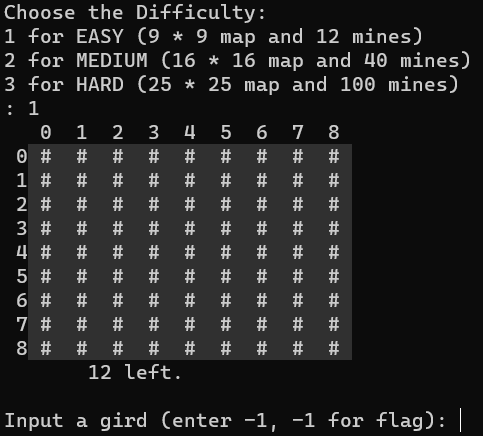
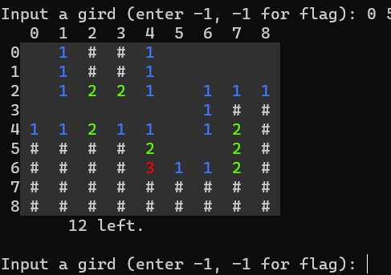
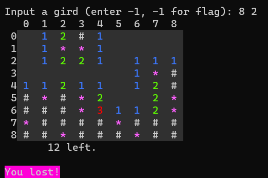
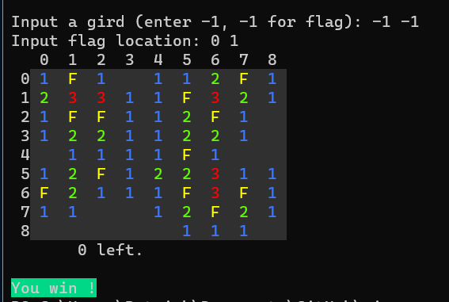

# Colorful Mine Sweeper
An easy little game to practice c++ and ansi escape

1. Choose difficulty and start the game  
   

---
2. Using ansi escape, input -1 -1 for flagging  
  
---
3. Lose when you open a mine

---
4. Flag all mines correctly to win the game  
