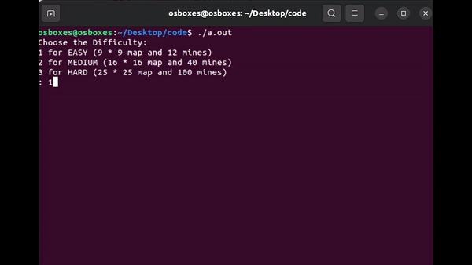
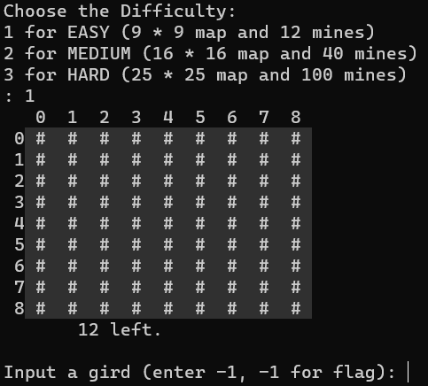
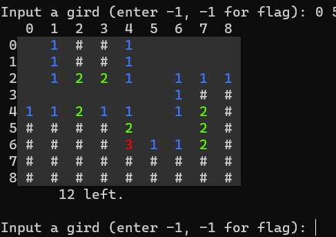
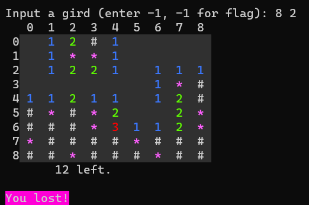
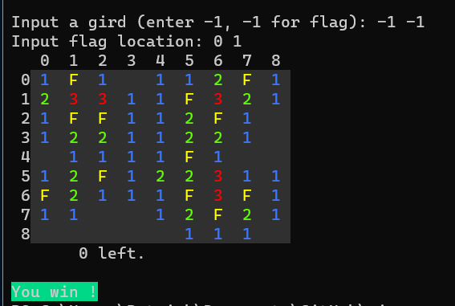

# Clickable Minesweeper
[Further explain](https://medium.com/@smefyb/clickable-minesweeper-game-a19dc2e1db64)  
**An easy little game to practice c++ and ansi escape**  
> Using only ANSI escape, no ncurses.  
Works on Linux system, some OS or CLI doesn't support listening to mouse click events  
#### TODO 
* Fix the input issue, currently it only works on minefield smaller than $9 * 9$.

* After every click you need to press enter. I will fix this if i have time
* Modify the ouput so it won't need to print the minefield during every loop
---  
Left click on grid to reveal.  
Right click on grid to set flag, click on existing flag to disable it.

# Colorful Mine Sweeper
1. Choose difficulty and start the game  
   

---
2. Using ansi escape, input -1 -1 for flagging  
  
---
3. Lose when you open a mine  

---
4. Flag all mines correctly to win the game  

