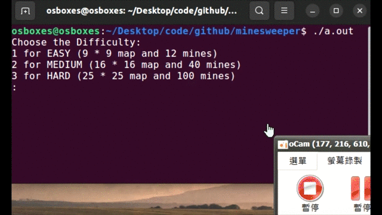

# Clickable Minesweeper
[Further explain](https://medium.com/@smefyb/clickable-minesweeper-game-a19dc2e1db64)  
**An easy little game to practice c++ and ansi escape**  
> Using ANSI escape, no ncurses.  

#### TODO 
* Fix the input issue, currently it only works on minefield smaller than $9 * 9$.
* Add some decorations
<!--fixed:   * After every click you need to press enter. I will fix this if i have time--> 
<!--fixed: * Modify the ouput so it won't need to print the minefield during every loop -->
---  
Left click on grid to reveal.  
Right click on grid to set flag, click on existing flag to disable it.

  

### Running
Should work well on any terminal supporting color display and can listen to mouse clicks.  
* Linux OS terminal should be fine
* Using Mac OS default terminal will have some minor issues
# Colorful Mine Sweeper
1. Choose difficulty and start the game  
   

---
2. Using ansi escape, input -1 -1 for flagging  
  
---
3. Lose when you open a mine  

---
4. Flag all mines correctly to win the game  

### Running
Can run on any terminal supporting color display.